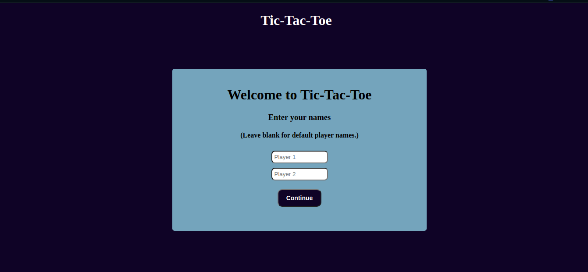

# Tic-tac-toe - An in browser game(no backend)

>Built the tic-tac-toe game with Javascript CSS and HTML.



## Table of Contents

- [Features](#features)
- [Built With](#built-with)
- [Live Demo](#live-demo)
- [Getting Started](#getting-started)
  - [Installation](#installation)
  - [Usage](#usage)
- [Authors](#authors)

## Features

- Allows two players to start a game and play against each other.

- Players can choose a name of their liking.

- Players can restart the game.

## Built With

- HTML
- CSS
- Javascript

## Live Demo

[Live Demo Link](https://raw.githack.com/tzvaita/javascript-tictactoe/feature/game/index.html)

## Getting Started

To get a local copy up and running follow these simple example steps.

<!-- ### Prerequisites -->

<!-- ### Setup -->

### Installation

Clone the repo with:

```sh
git clone https://github.com/tzvaita/javascript-tictactoe
```

### Usage

Open `index.html` file in your browser.

<!-- ## Roadmap -->

<!-- ### Deployment -->

### Authors

👤 **Ramesh Naidu Allu**

- Github: [@rna](https://github.com/rna)
- Twitter: [@rnadev](https://twitter.com/rnadev)
- Linkedin: [Linkedin](https://linkedin.com/in/ramesh-naidu)

👤 **Tennyson Zvaita**

- Github: [@tzvaita](https://github.com/tzvaita)
- Twitter: [@tennyzvaita](https://twitter.com/tennyzvaita)

## 🤝 Contributing

Contributions, issues and feature requests are welcome!

Feel free to check the [issues page](issues/).

## Show your support

Give a ⭐️ if you like this project!

<!-- ## Acknowledgments -->

## 📝 License

This project is [MIT](lic.url) licensed.
